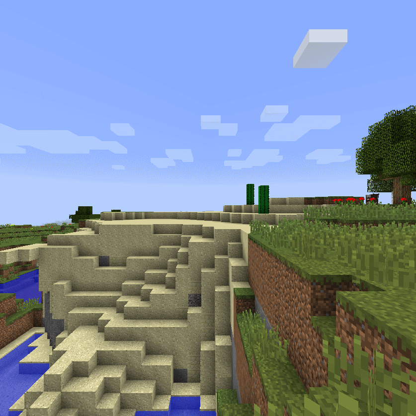
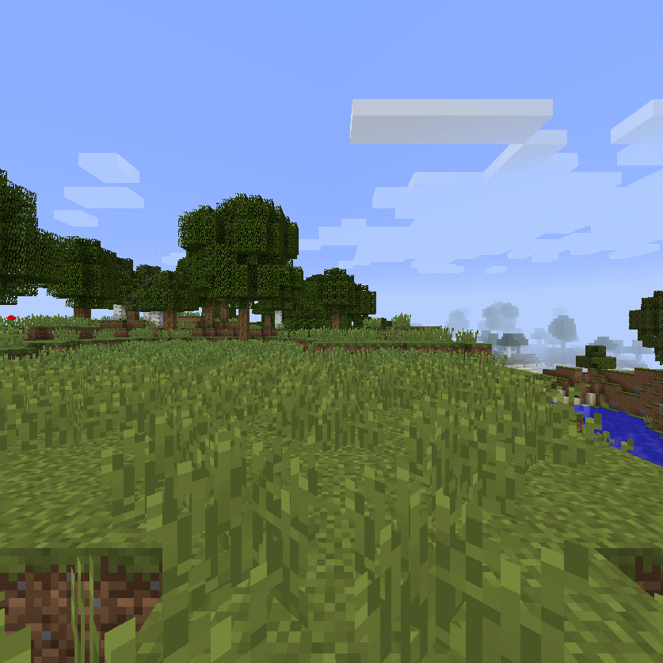
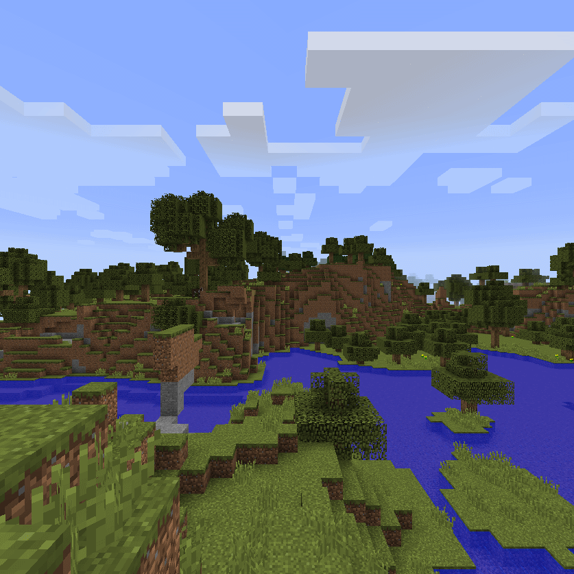

# original-panorama

**The original *Minecraft* menu panorama**

Have some nostalgia for the original menu panorama used from Beta 1.8 to Release 1.12.2, now in higher quality due to the world seed (2151901553968352745) being found.

This pack comes in two forms – one with the original *Minecraft* textures, and one with the modern Texture Update (1.14+) textures.

The `pack.mcmeta` file specifies that this pack is only for 1.15/1.16, but just change the `pack_version` if you want to use this for older versions of *Minecraft*.